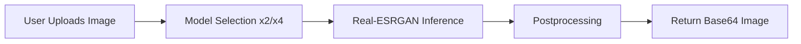
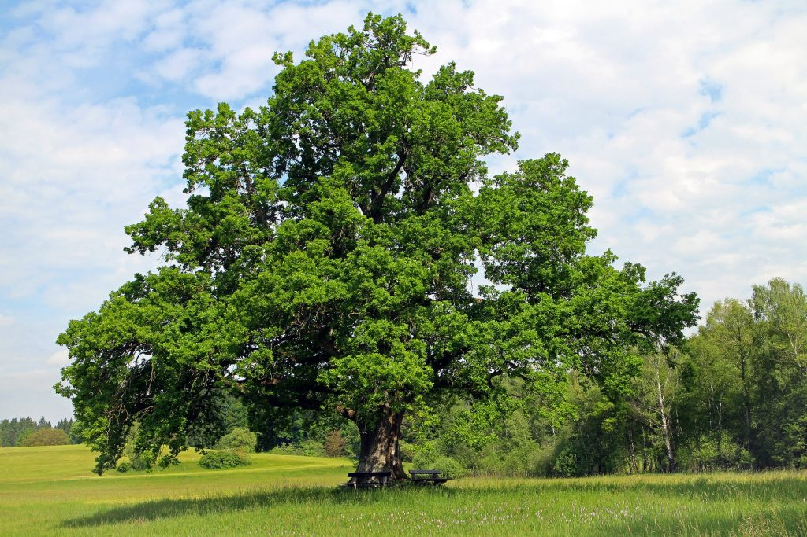
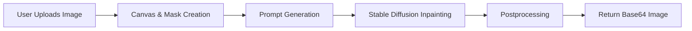
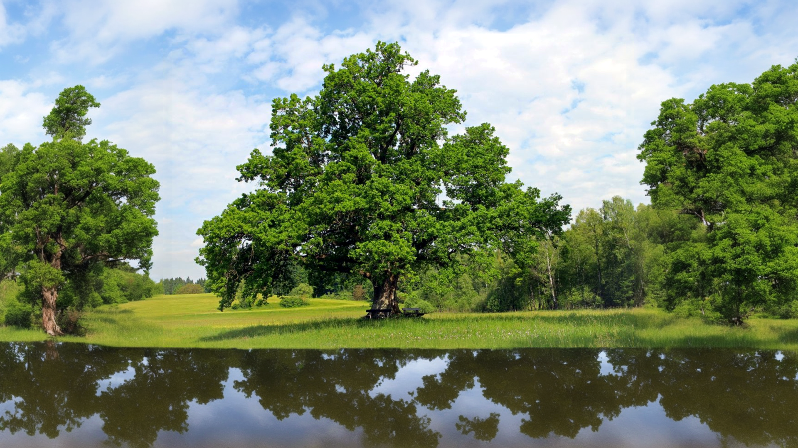

# Image Upscaling and Outpainting Backend API

This is the backend API for the Image Upscaling and Outpainting webapp. It uses Real-ESRGAN models for image upscaling and SD2.0 Inpainting for high-quality outpainting.

## Features

### Image Upscaling

The upscaling pipeline leverages Real-ESRGAN for high-quality, artifact-free image super-resolution. The process is as follows:

1. **Upload**: User uploads an image via the `/upscale` endpoint.
2. **Preprocessing**: The image is saved and loaded using Pillow and OpenCV.
3. **Model Selection**: The backend selects the appropriate Real-ESRGAN model (x2 or x4) based on the requested scale factor.
4. **Inference**: The model performs super-resolution on the image, optionally using tiling to avoid GPU OOM.
5. **Postprocessing**: The upscaled image is saved and returned as a base64-encoded PNG.

**Pipeline Diagram:**



**Example:**

| Input Image | Upscaled Output |
|-------------|----------------|
|  |  |

### Image Outpainting

The outpainting pipeline uses Stable Diffusion 2.0 Inpainting to extend images beyond their original borders, generating new content that blends seamlessly with the original. The process is as follows:

1. **Upload**: User uploads an image via the `/outpaint` endpoint, specifying `target_width` and `target_height`.
2. **Canvas Creation**: The backend creates a larger canvas and places the original image in the center, using edge extension for seamless blending.
3. **Mask Generation**: A professional mask is generated to indicate which regions should be inpainted.
4. **Prompt Generation**: The system analyzes the image and generates a smart prompt for the diffusion model.
5. **Inference**: Stable Diffusion Inpainting generates new content for the masked regions.
6. **Postprocessing**: The result is enhanced for contrast and color, then returned as a base64-encoded PNG.

**Pipeline Diagram:**



**Example:**

| Original Image | Outpainted Output |
|---------------|-------------------|
|  |  |

## Setup Instructions

### Prerequisites

- Python 3.7 or higher
- CUDA-compatible GPU (required)
- Pytorch 2.7 + cu118 or higher 

### Installation

1. Clone this repository.
2. Ensure you have Python 3.7+ installed.
3. It is recommended to use a virtual environment:
   ```bash
   python -m venv venv
   source venv/bin/activate  # On Windows use `venv\Scripts\activate`
   ```
4. Install the required dependencies:
   ```bash
   pip install -r requirements.txt
   ```
5. Download the model weights. The application will look for them in `weights/` first, and then in `Real-ESRGAN-master/weights/`. Create the appropriate directory and place the `.pth` files there:
   - [RealESRGAN_x4plus.pth](https://github.com/xinntao/Real-ESRGAN/releases/download/v0.1.0/RealESRGAN_x4plus.pth)
   - [RealESRGAN_x2plus.pth](https://github.com/xinntao/Real-ESRGAN/releases/download/v0.2.1/RealESRGAN_x2plus.pth)

### Running the API

Navigate to the `backend` directory and run the FastAPI application using Uvicorn:

```bash
uvicorn main:app --reload --host localhost --port 8000
```
or
```bash
run_server.bat
```

The API will be available at `http://localhost:8000`.

## API Endpoints

### Health Check

```
GET /health
```

Returns the status of the API and whether the models are loaded.

### Upscale Image

```
POST /upscale
```

Parameters (form-data):
- `image`: The image file to upscale
- `scale_factor`: The scale factor to use (2 or 4, default: 4)
- `outscale`: The final output scale (default: 4.0)

### Outpaint Image

```
POST /outpaint
```

Parameters (form-data):
- `image`: The image file to outpaint
- `target_width`: Target width for the outpainted image (default: 1920)
- `target_height`: Target height for the outpainted image (default: 1080)

## Integration with Frontend

The API is CORS-enabled, so it can be called from any frontend application. The frontend should send requests to the API endpoints and handle the responses accordingly.

Example frontend code (TypeScript):

```javascript
async function upscaleImage(imageFile) {
  const formData = new FormData();
  formData.append('image', imageFile);
  formData.append('scale_factor', '4');
  formData.append('outscale', '4.0');
  
  const response = await fetch('http://localhost:8000/upscale', {
    method: 'POST',
    body: formData,
  });
  
  const data = await response.json();
  if (data.success) {
    // data.image contains the base64-encoded upscaled image
    return `data:image/png;base64,${data.image}`;
  } else {
    throw new Error(data.error);
  }
}
```